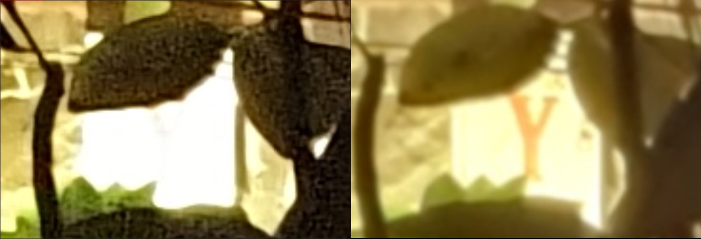
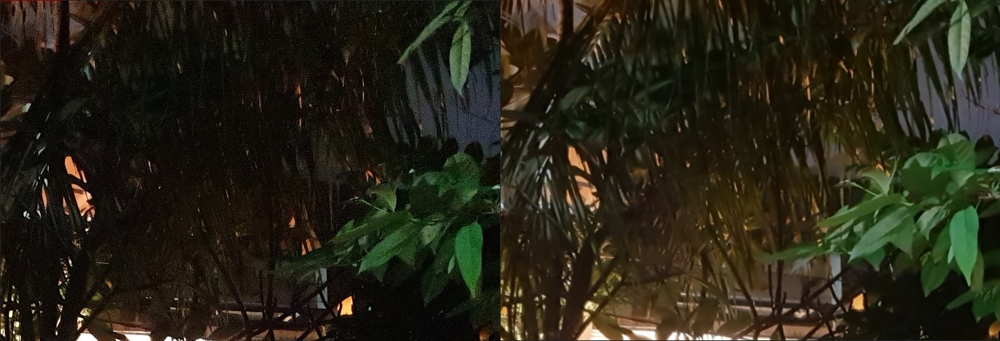

Implementation of night mode photography algorithm utilizing histogram equalization, image registration, and Mertens exposure fusion.

## Result Samples

**Left: Samsung's auto mode, Right: Resulting image from the algorithm (with the same hardware)**

## Algorithm

In short, the algorithm is as follow:  

#### A. Color Conversion  

1. A series of RGB images are taken with a different value of exposure time.  
2. A set of new images (GS Images) is created by converting the RGB images to grayscale images and applying histogram equalization.  

#### B. Image Registration  

The images need to be aligned to cope with little spatial shifts between images because of shaking hands.  

1. The first GS image is taken as the frame of reference. Fourier transforms this image from spatial to frequency domain. Let's call this image "reference."  
2. For the rest of the GS images:  

* Fourier transforms the image from spatial domain to frequency domain.
* Obtains the normalized cross-correlation matrix by inverse Fourier transforming the cross-power spectrum between this image and the reference.
* The coordinate of the maximum value in this matrix reflects the shift in pixel coordinate between those two images.
* The source RGB image is then shifted based on this shift in pixel values. The resulting image is the output of image registration.  

#### C. Exposure Fusion

1. Mertens exposure fusion algorithm[<a href="https://dl.acm.org/doi/abs/10.1109/PG.2007.23" target="_blank">1</a>] is carried out using the first RGB image (RGB source of the reference) and all image registration's output as the input.
2. A Gaussian filter is applied to smooth out the resulting image.

## References

\[1] Tom Mertens, Jan Kautz, and Frank Van Reeth. 2007. Exposure Fusion. In Proceedings of the 15th Pacific Conference on Computer Graphics and Applications (PG '07). IEEE Computer Society, USA, 382–390. DOI:https://doi.org/10.1109/PG.2007.23

Packages used for the project:

1. [Scikit-image](https://scikit-image.org/)
2. [OpenCV](https://opencv.org/)

This work is done as a submission for the Image-based Measurements class' final project.
